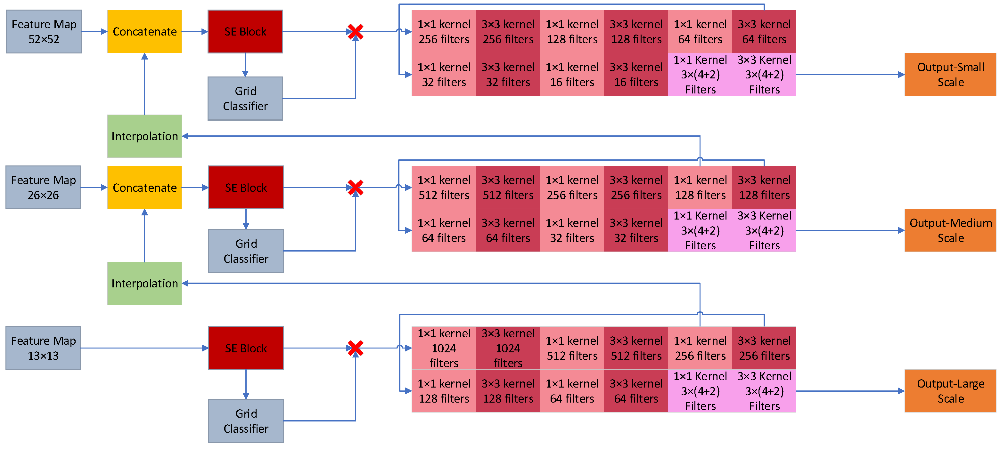

# Real-Time Pedestrian Detection Using Enhanced Representations from Light-Weight YOLO Network

DeepFusion is a pedestrian detection model which uses RGB images and radar point clouds. The major contribution in this work was to decrease the processing time while maintaining accuracy. For this purpose, we significantly reduced the dimensions of input images and modified the main YOLOv3 network to compensate the reduction of accuracy due to reduced resolution. This work is accepted and presented at the 8th International Conference on Control, Decision and Information Technologies (CoDIT 2022)  and will be published in IEEE Xplore. 

  

## Contact
For any questions or suggestions please reach out to [sshirahm@uwaterloo.ca](mailto:sshirahm@uwaterloo.ca)! 

## Abstract
Pedestrian detection is one of the significant tasks
in Autonomous Vehicles (AVs). There are two kinds of networks
which are widely used for pedestrian detection: single-stage networks and region-based networks. Single-stage networks, such
as YOLO, solve the bounding box regression and classification
problems simultaneously which makes them faster than region-based networks such as Faster R-CNN. Nonetheless, the main
structure of YOLO is too complex and slow for the pedestrian detection task in AVs and cannot detect small pedestrians.
Furthermore, unlike region-based networks where all features of the region containing a pedestrian is used in classification,
in YOLO only the features of a cell in which the center of
anchor box lies is used in classification. In this paper, these
issues related to YOLO will be addressed such that it can be
better used for pedestrian detection.

# Highlights

- **Simple:** We use the renowned YOLOv3 network with its backbone replaced with MobileNetv3. Furthermore, Attention modules and some architecture modifications have been made to the head of YOLOv3 network for improvement of accuracy.

- **Fast and Accurate**: Our best model achieves *74.2* AP with confidence and Intersection over Union (IoU) threshold @0.5 on INRIA while running at 30FPS+. 

- **Extensible**: The backbone, head, and other parts of the network can be easily replaced.

## Main results

#### Detection on INRIA test set 

|            | Recall | Precision | F1 Score | Average Precision (AP) | FPS |
|------------|--------|-----------|----------|------------------------|-----|
| DeepFusion | 74.5   | 97.8      | 84.6     | 74.2                   | 34  | 

Results are tested on a NVIDIA GeForce RTX 3060 GPU with batch size 1.

  

  

### Installation

This work is implemented in PyTorch and Tensorflow. The Tensorflow version only supports INRIA dataset. Please install the packages listed in requirements.txt document and torch from https://pytorch.org/.

### Benchmark Evaluation and Training 

All detection, dataset, post-processing, training, test, and model are included in [configs](./PyTorch_codes/configs). To create the bounding groundtruth and input information of each dataset, run create_data.py. To train the network, run train.py. To evaluate the model and visualization of results run test.py.

### ToDo List
- [ ] Test it on Caltech dataset
- [ ] Test it on NuScenes dataset
- [ ] Test the fusion of RGB images with radar point clouds in NuScenes.

## Acknowlegement
This project would not have been possible without multiple great opensourced codebases. We list some notable examples below.  

* [CenterPoint](https://github.com/tianweiy/CenterPoint)
* [pedestrian-detection-in-hazy-weather](https://github.com/YoungYoung619/pedestrian-detection-in-hazy-weather)

